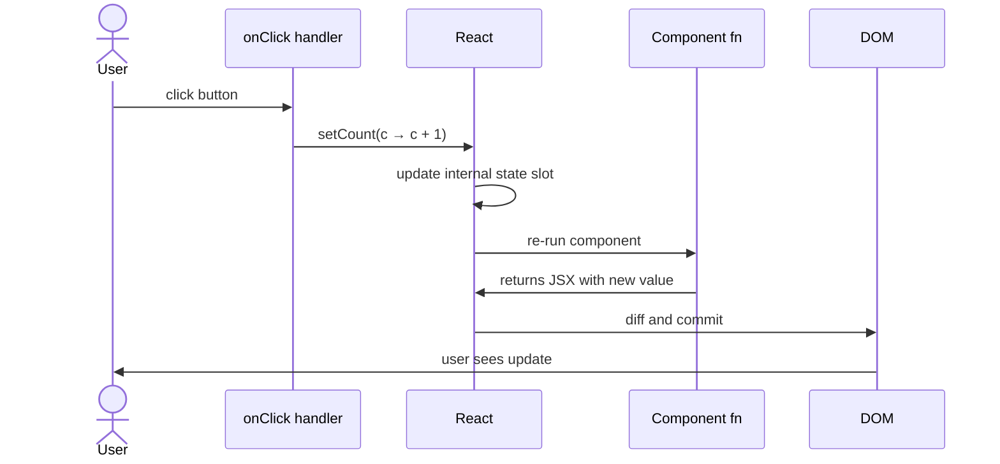
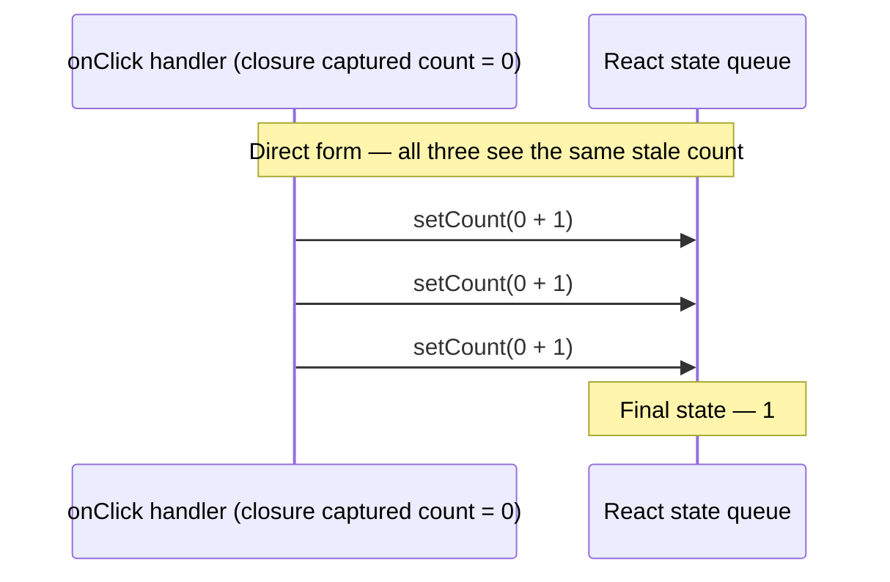
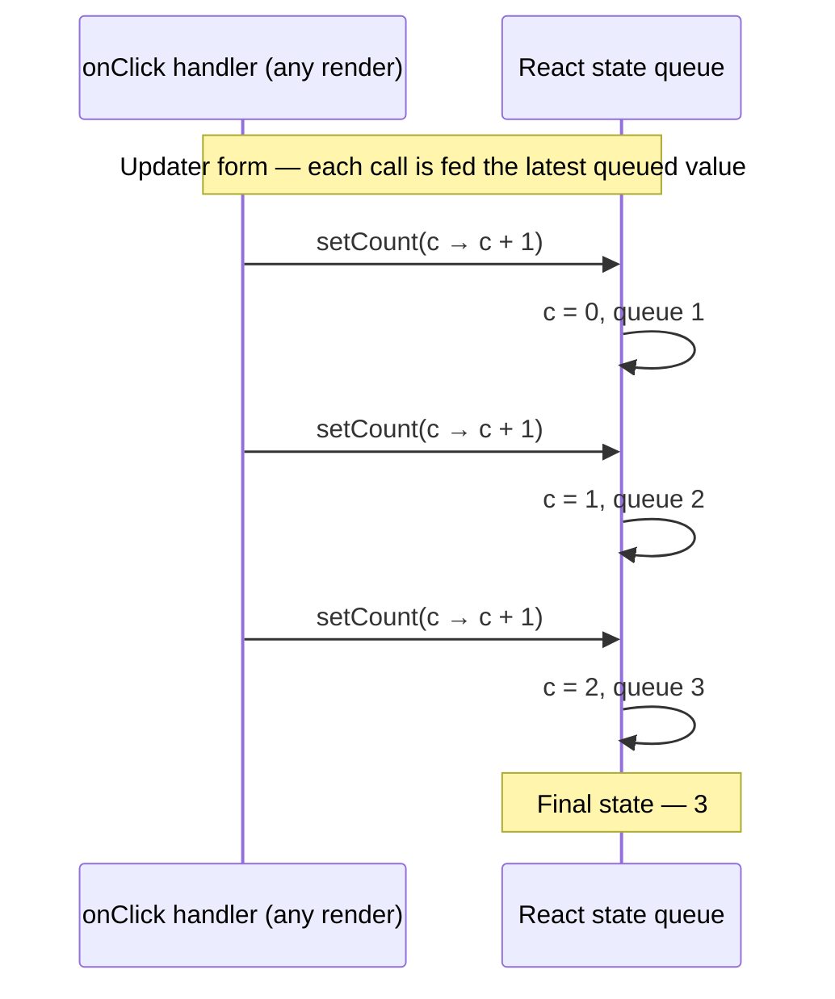

# Chapter 1. React & TypeScript Foundations

Modern frontend development is dominated by two ideas working in tandem: React, which lets us describe user interfaces as a function of data, and TypeScript, which lets us describe the *shape* of that data so the compiler catches mistakes before our users do. This chapter introduces both — not as a reference, but as a working mental model you can carry into every chapter that follows.

We will build only one thing here: a small **Typed Counter** app. By the time you finish, you should understand what a component really is, why React re-runs your function on every change, how to model props with TypeScript interfaces, and where state fits in.

> **Chapter project — Typed Counter App**
>
> A multi-counter app where each counter has a typed `label`, `step` size, and `min`/`max` constraints. Practice strict prop interfaces and controlled state.
>
> *Capstone connection:* your ChatGPT clone uses React state to track the message list — this is the same primitive, scaled up.

## What you'll learn

- The mental model: components are JavaScript functions that return UI.
- JSX, attribute differences from HTML, and how a component is laid out top to bottom.
- How to type props with a TypeScript `interface` and provide defaults.
- The `useState` hook — what it does, why it triggers re-renders, and how to update state correctly with the *updater form*.
- The difference between props and state, and when (rarely) to copy one into the other.
- Typed event handlers and the most common conditional-rendering patterns.

> **A note on scope.** This chapter intentionally covers only `useState`. Hooks like `useEffect`, `useRef`, `useMemo` and the custom-hook pattern arrive in **Chapter 2**, where they belong with their full context. If a question pulls you toward those topics, file it for later — it's coming.

## 1.1 Components Are Just Functions

The first idea to internalise is that **a React component is an ordinary JavaScript function**. It takes some inputs (its *props*), and it returns a description of what to render. There is no class, no special framework class to extend, no template language. The function is the component.

```tsx
function Greeting() {
  return <h1>Hello, world</h1>;
}
```

The slightly unusual thing here is the `<h1>` sitting in the middle of JavaScript. That's **JSX** — a syntax extension that the compiler turns into ordinary `React.createElement(...)` calls. JSX is not strings. It's not a template. It's a value: an expression that evaluates to a small object describing UI. You can store it in variables, pass it to functions, and return it from components.

Because JSX is JavaScript, a few things from HTML are renamed to avoid clashes with reserved words and the JavaScript naming convention:

| HTML | JSX |
| --- | --- |
| `class` | `className` |
| `for` | `htmlFor` |
| `tabindex`, `onclick`, etc. | `tabIndex`, `onClick`, etc. (camelCase) |

A component must return a single root element. If you genuinely need to return multiple siblings without a wrapper element, use the empty fragment syntax:

```tsx
return (
  <>
    <h1>Title</h1>
    <p>Subtitle</p>
  </>
);
```

> **Note.** Component names start with an uppercase letter (`Greeting`, not `greeting`). React uses the case of the JSX tag to distinguish a component (`<Greeting />`) from a regular DOM element (`<h1 />`). Lowercase tags are interpreted as DOM elements.

> **Sidebar — components must be *pure*.** A component should be a deterministic function of its props and state: same inputs in, same JSX out, no side effects during render. No mutating outside variables, no `fetch()`-ing, no writing to `localStorage`, no `console.log`-ing things you'd be surprised to see twice. (Side effects belong in event handlers or — as we'll see in Chapter 2 — `useEffect`.) React enforces this discipline in development by running components twice in a feature called **Strict Mode**: if your render logic is pure, the doubled invocation is invisible; if it isn't, the bug surfaces immediately. We'll see this with our own eyes in the chapter project.

## 1.2 The Anatomy of a Component

Inside the function, conventional React code follows a top-to-bottom shape: **declarations first, JSX last**. We'll see why each section matters as the chapter progresses; for now, recognise the layout.

```tsx
"use client"; // required in Next.js when the file uses hooks (see §1.5)

import { useState } from "react";

interface CounterProps {
  label: string;
  step?: number;
}

export function Counter({ label, step = 1 }: CounterProps) {
  // 1. Hooks first — always at the top, in the same order every render.
  const [count, setCount] = useState(0);

  // 2. Derived values and event handlers.
  const handleClick = () => setCount((c) => c + step);

  // 3. JSX — the only thing returned.
  return (
    <div>
      <p>{label}: {count}</p>
      <button onClick={handleClick}>+{step}</button>
    </div>
  );
}
```

> **Warning — the Rules of Hooks.** Hooks (`useState` and friends) must be called at the **top level** of the component, in the **same order, on every render**. That means: no calling them inside `if`, no calling them inside loops, no calling them after an early `return`. React identifies which hook is which by call order, not by name; a conditional call corrupts that order and React will complain — loudly.

Two practical reasons the layout matters: it puts the things that determine *when* the component renders (state) at the top so they're easy to find, and it lets the JSX at the bottom read like a description of the output rather than a tangle of logic.

> **Tip — Compute, don't store.** If a value is fully determined by props or state, just compute it as a regular `const` in the body — don't put it in another `useState`. Storing derived values is a popular antipattern that we'll dissect properly in Chapter 2.

## 1.3 Props: Passing Data In

Props are how a parent component passes data into a child. Inside the child, props are nothing more than the function's argument — an object whose keys are the attributes the parent supplied.

```tsx
<Counter label="Apples" step={2} />
```

```tsx
function Counter(props: CounterProps) {
  return <p>{props.label}</p>;
}
```

You will almost always see props *destructured* in the parameter list. It's identical in behaviour, just easier on the eye:

```tsx
function Counter({ label, step }: CounterProps) {
  return <p>{label}</p>;
}
```

### Typing props with a TypeScript interface

Two things matter here. First: the interface describes the *shape* the parent must supply. Second: the `: CounterProps` after the parameter is TypeScript saying "this argument has this shape" — exactly the same idea as `function add(a: number, b: number)`.

```tsx
interface CounterProps {
  label: string;       // required
  step?: number;       // optional — note the `?`
  min?: number;
  max?: number;
}
```

The `?` makes a prop optional. If the parent omits it, the value inside the component is `undefined` — which is why most code combines optional props with defaults during destructuring:

```tsx
function Counter({ label, step = 1, min = 0, max = 100 }: CounterProps) {
  // step, min, max are guaranteed numbers from here on
}
```

This is the cleanest pattern: the type says the prop is *optional*, the destructuring says *what to fall back to*, and the rest of the body can treat the value as a plain number rather than `number | undefined`.

> **Note.** You may have seen `React.FC` in older code (`const Counter: React.FC<CounterProps> = ...`). It works, but it implicitly adds a `children` prop and complicates generics. Modern React style is to type props directly, as we have above.

> **Warning — null vs undefined.** A default in destructuring (`step = 1`) only fires when the prop is `undefined` (or omitted). If the parent explicitly passes `step={null}`, the default is *skipped* and you get `null`. Keep the prop type as `step?: number` (not `number | null`) and you'll never face this.

## 1.4 State: Values That Live Across Renders

Imagine writing a counter without React:

```tsx
function Counter() {
  let count = 0;
  return <button onClick={() => count++}>{count}</button>;
}
```

This never updates the screen. Two things are wrong. First, mutating `count` doesn't tell React anything happened, so the screen never changes. Second — and this is the deeper point — even if React re-ran the function, the next call would re-declare `let count = 0` from scratch and lose the previous value. **Plain variables don't persist between renders.**

This is what `useState` solves:

```tsx
const [count, setCount] = useState(0);
```

`useState` is a *hook*: a special function that connects your component to React's internal state storage. Two things come out of it, in an array we destructure:

```tsx
const [count, setCount] = useState(0);
//     ^value   ^setter      ^initial value
```

- `count` is the current value, read fresh on every render.
- `setCount` is a function that updates the value **and schedules a re-render**.

That last part is the magic. When you call `setCount(5)`, React doesn't just write `5` somewhere — it queues a re-render of your component. The component function runs again, `useState` returns the new value, and React swaps the result into the DOM.

> **Figure 1.1.** The render cycle of a `useState`-driven component, end-to-end. Note that the component function runs *again* after every state change — that's the whole point of "components are just functions that re-run."



### Updating state correctly: the updater form

There are two ways to call the setter:

```tsx
setCount(count + 1);          // direct: pass the new value
setCount((c) => c + 1);       // updater: pass a function that derives the new value
```

The direct form looks simpler, but it has a subtle bug when multiple updates run in the same event handler:

```tsx
const handleClick = () => {
  setCount(count + 1);
  setCount(count + 1);
  setCount(count + 1);
};
```

You might expect three increments. You get one. Why: `count` was captured in the closure when the handler was created during the previous render, so all three calls see the same stale value (`0`), and all three queue `setCount(1)`.

The updater form fixes this — React feeds the latest queued value into your function:

```tsx
const handleClick = () => {
  setCount((c) => c + 1);   // c = 0, queues 1
  setCount((c) => c + 1);   // c = 1, queues 2
  setCount((c) => c + 1);   // c = 2, queues 3
};
```

> **Rule of thumb.** Whenever the next state depends on the previous one, use the updater form. Always.

We will revisit the closure mechanics in detail in **Chapter 2** — for now, treat the updater form as the safe default.

> **Figure 1.2.** Why the updater form matters. The same three calls produce different results depending on which form you use, because the direct form's `count` is a stale closure capture from the previous render, while the updater form is fed the *latest queued value* by React.





## 1.5 Reading Inside-Out: Dissecting an Updater

Take this line from the Typed Counter:

```tsx
const increment = () => setCount((c) => Math.min(c + step, max));
```

It is a lot of arrows. Let's read it from the inside out.

1. `(c) => Math.min(c + step, max)` is an arrow function. It declares one parameter (named `c` here, though the name is yours to choose) and returns the result of `Math.min(c + step, max)`.
2. That arrow function is passed to `setCount(...)`. This is the **updater form** of the setter.
3. The whole thing is wrapped in `() => setCount(...)`, an outer arrow with no parameters. This is `increment`: a function we'll attach to a button's `onClick`.

When the button is clicked, here is what happens:

```ts
function setCount(updater) {
  const previous = /* React's internal slot for count */;
  const next     = updater(previous);   // ← this is where `c` gets its value
  // schedule a re-render with `next`
}
```

So `c` is **a parameter you declare and React fills in**. The name is yours; it could be `prev`, `previousCount`, or anything else. These three lines are interchangeable:

```tsx
setCount((c) => c + step);
setCount((prev) => prev + step);
setCount((previousCount) => previousCount + step);
```

The verbose form makes the structure visible:

```tsx
const increment = () => {
  setCount((previousCount) => {
    const next = previousCount + step;
    return Math.min(next, max);
  });
};
```

Both forms produce identical behaviour. The one-liner is just the same thing with implicit returns and shorter names.

> **Next.js gotcha.** A component that uses `useState` (or any other hook) needs to be a *Client Component* in Next.js. If you see an error like `"You're importing a component that needs useState..."`, add the directive `"use client";` as the very first line of the file. We'll cover the server/client distinction properly in Chapter 7.

## 1.6 Props vs State

Now that we've met both, the question that trips up almost every beginner is: *do I need to save my props somewhere?* The answer is no — props are already variables inside the function the moment you destructure them. Use them directly.

The rare exception is when a prop is just an **initial value** and the component takes ownership of the value afterwards. The Typed Counter's `min` is a good example: the parent says "start at 5"; the component then owns `count` from that point on. So we use `min` as the seed for `useState`:

```tsx
function TypedCounter({ label, step = 1, min = 0, max = 100 }: TypedCounterProps) {
  const [count, setCount] = useState(min);  // seed with min, then own it
  // label, step, max remain props — read directly
}
```

> **Mental model.** Props are inputs from the parent: read them, don't copy them. State is values this component owns and can change: use `useState` for those. Blanket-copying props into state causes "stale state" bugs where the prop updates but the local copy doesn't.

## 1.7 Event Handlers

User interactions arrive as DOM events: clicks, key presses, form submissions, input changes. In JSX you attach a handler with the camelCase event prop:

```tsx
<button onClick={() => doThing()}>Go</button>
```

For one-liners, an inline arrow function is fine. As soon as the body grows, pull it out into a `const` above the JSX — readability beats minimalism:

```tsx
function Counter({ step = 1 }: CounterProps) {
  const [count, setCount] = useState(0);
  const handleClick = () => setCount((c) => c + step);
  return <button onClick={handleClick}>+{step}</button>;
}
```

> **Myth, busted.** You may have heard "inline arrow functions cause re-renders." This is a half-truth. Each render creates a new function reference, but React doesn't care — it only matters when passing the function to a `React.memo`'d child whose memoisation depends on prop identity. We'll cover the proper fix (`useCallback`) in Chapter 2. For everyday code, prefer clarity.

When TypeScript needs to know the shape of an event, it usually figures it out from the JSX attribute. If you write `onChange={(e) => ...}`, TS infers `e` as a `React.ChangeEvent<HTMLInputElement>`. The cases where you have to be explicit are when you extract the handler into a separate file or a hook.

For Chapter 1 you only need two:

- `React.MouseEvent<HTMLButtonElement>` — the type of `e` for `<button onClick={...}>`.
- `React.ChangeEvent<HTMLInputElement>` — the type of `e` for `<input onChange={...}>`. Read the value via `e.target.value`.

## 1.8 Conditional Rendering

Often you want to show different UI depending on state. JSX has no `if` keyword, but it doesn't need one — JSX is just JavaScript expressions, so you use the language's existing tools.

**Ternary, for either/or:**

```tsx
{isLoading ? <Spinner /> : <Content />}
```

**Logical AND, for "render if":**

```tsx
{error && <ErrorMessage text={error} />}
```

> **Warning — the `0` trap.** `&&` works because `false` and `null` render nothing. But `0` is *falsy*, and React renders `0` as the string `"0"`. The expression `{count && <X />}` will print `0` to the page when `count` is zero. Make the test explicit: `{count > 0 && <X />}`.

**Early `return null`** when the entire component should render nothing:

```tsx
if (!user) return null;
return <Profile user={user} />;
```

## 1.9 Building the Typed Counter

You now have everything you need. Here is the full chapter project, with the structure laid out so you can build it in pieces.

### Folder layout

```
app/ch01-foundations/
  page.tsx                          # chapter landing — links to /typed-counter
  typed-counter/
    page.tsx                        # the route at /ch01-foundations/typed-counter
    typed-counter.tsx               # the reusable component
```

> **Why split the component out of `page.tsx`?** In Next.js's App Router, `page.tsx` is reserved — it's the file Next renders for that URL, and it receives framework-controlled props (`params`, `searchParams`). It is not a regular reusable module. Keep `page.tsx` as a thin wrapper that imports your real components from sibling files.


### Stretch goals

- Render five counters with very different `step`/`min`/`max` combinations and confirm each maintains its own state independently.
- Disable the increment button when `count` is already at `max`, the decrement button when at `min`. (The boilerplate above already does this — make sure you understand *why* `disabled={count >= max}` is sufficient.)
- Add a "Reset" button that returns the count to `min`.

### Exercise — see Strict Mode in action

Open the dev server, open the browser's DevTools console, and add a log line at the very top of `TypedCounter`:

```tsx
export function TypedCounter({ label, step = 1, min = 0, max = 100 }: TypedCounterProps) {
  console.log(`render: ${label}`);
  // …rest of the component
}
```

Now click an increment button. How many times does `render: Apples` appear in the console?

Almost certainly **two**, not one. That's React's *Strict Mode* (which Next.js enables in development) deliberately running the component body twice on each render to expose impure logic. The double render does not happen in production — it's a development-only safety net.

Try this:

1. Add a second log inside the updater: `setCount((c) => { console.log(`updater for ${label}`); return c + step; });`. How many times does *that* fire per click?
2. Replace the updater with the direct form (`setCount(count + step)`). Does the doubled render still happen? (It does — Strict Mode doesn't care which form you use.)
3. *Carefully*: add a side-effecting line during render, like `someExternalArray.push(count)`. Watch the array end up with two entries per render. This is the bug Strict Mode is designed to surface — components must be pure functions of their props and state, with no side effects during render.

When you're done, remove the experimental logs.

> **Worth knowing.** Strict Mode also double-invokes the function passed to `useState(() => ...)` and to `useMemo`. We'll cover those in Chapter 2 — but the principle is the same: any function React might run during render must be safe to run twice.

## Summary

You learned that components are functions, that JSX is just sugar for object construction, and that React re-runs the function any time state changes. You typed the component's inputs with a TypeScript interface, gave optional props sensible defaults, and used `useState` to hold a value across renders. You met the *updater form* of a setter and saw why the next state should be derived from the previous via a function rather than a captured variable. You learned that props are read-only inputs and state is owned data, and that copying one into the other is almost always a mistake.

In **Chapter 2** we'll keep going with hooks: why re-renders happen the way they do, the rest of the standard hook library (`useEffect`, `useRef`, `useMemo`, `useCallback`), the newer ones (`useId`, `useTransition`, `useDeferredValue`), and how to compose your own custom hooks — including a `useLocalStorage` we'll use to retrofit this very counter so its values survive a page reload.
