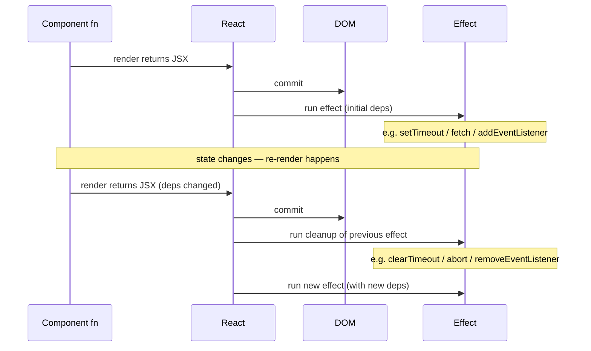
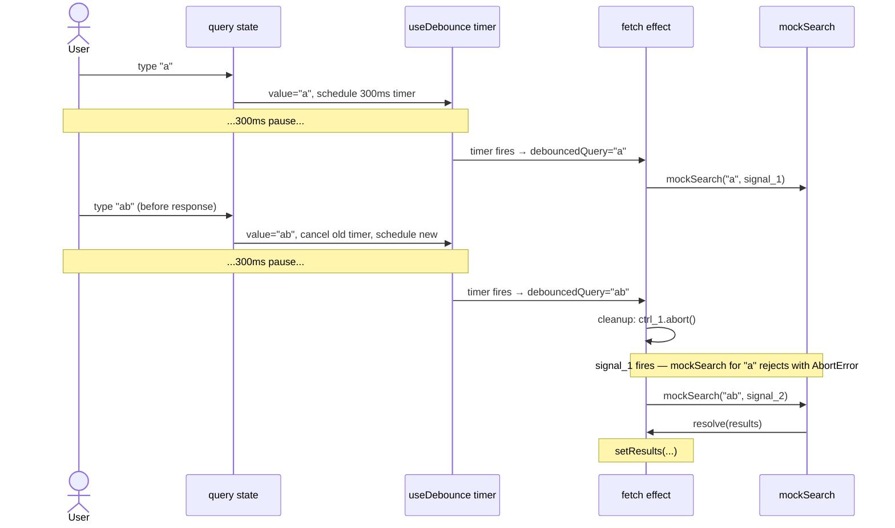

# Chapter 2. React Hooks Deep Dive

In Chapter 1 we treated `useState` as a black box: a function that gives us a value and a setter, and somehow the screen updates when we call the setter. That was enough to ship a counter, but it leaves a lot unexplained. *Why* does React re-run our function? *When* does it re-run it? What other hooks exist, and which ones matter? When are they helpful, and when do they make code worse?

This chapter answers those questions. By the end you should be able to look at any React file and predict, just from reading top to bottom, when it re-renders, what runs after each render, and which values stick around between them. You should also have a working understanding of the lesser-used hooks and the *single most important question* React beginners learn to ask: "Should this even be a hook at all?"

> **Chapter project — Live Search Widget**
>
> A search input that debounces API calls with a custom `useDebounce` hook, caches results with `useMemo`, and tracks focus/blur with `useRef` — all typed with TypeScript. The classic hooks gauntlet.
>
> *Capstone connection:* your ChatGPT clone uses `useState` for the message list, `useEffect` to auto-scroll the conversation, `useRef` for the input field, and a custom `useChat` hook to wrap the streaming logic.

## What you'll learn

- The render lifecycle: why React re-runs your component function and what that implies for variables and closures.
- Batched updates and the **stale closure trap** — why the updater form of setters isn't optional.
- `useEffect` and the dependency array, explained as synchronisation with the world outside React.
- The most important React skill: **knowing when *not* to use `useEffect`**.
- `useRef` for values that persist without causing re-renders, and for direct DOM access.
- `useMemo` for caching expensive computation; `useCallback` for stabilising function identity.
- The newer hooks: `useId`, `useTransition`, `useDeferredValue`.
- How to write your own custom hooks — and a working `useDebounce` and `useLocalStorage`, the second of which we'll use to revisit Chapter 1's counter.

## 2.1 What "Re-render" Actually Means

The first thing to make peace with is that **a React component is a function that runs every time React decides to re-render it**. That's the whole framework, in one sentence. There is no instance, no permanent variables, no `this`. Each render is a fresh execution of the function body from top to bottom.

That has consequences. Consider the broken counter from Chapter 1:

```tsx
function Counter() {
  let count = 0;
  return <button onClick={() => count++}>{count}</button>;
}
```

Two problems, both rooted in the function-runs-every-time model:

1. Mutating `count` doesn't tell React anything happened, so the screen never changes.
2. Even if React re-ran the function, the next call would re-declare `let count = 0` from scratch and lose the previous value. Plain variables don't survive a render.

`useState` fixes both at once: it stores the value *outside* the function (in React's internal state slot for this component instance), and it gives you a setter that **schedules a re-render** when called. The next call reads the new value back.

```tsx
const [count, setCount] = useState(0);   // value lives outside this function
setCount(1);                              // writes 1 + schedules re-render
```

> **Mental model.** Every `useState` call corresponds to a slot. React tracks slots by the *order* in which hooks are called during the render. That's why the Rules of Hooks demand that hooks be called at the top level, in the same order, on every render — call them conditionally and the slot order shifts, and React will mistake your `[query, setQuery]` for somebody else's `[count, setCount]`.

Three rules of thumb fall out of the lifecycle:

1. **Treat state as immutable.** `array.push()` doesn't trigger anything. React only re-renders when the setter runs.
2. **`setState` replaces, doesn't merge.** Calling `setForm({ name: "x" })` *replaces* the whole form object. To update one field, spread the previous value: `setForm(f => ({ ...f, name: "x" }))`.
3. **Initial values run on every render — but only the first one is used.** If you write `useState(expensiveCompute())`, the function runs on every render and React throws away the result every time but the first. Use the *lazy* form for expensive setup: `useState(() => expensiveCompute())`. React calls the function exactly once.

## 2.2 The Stale Closure Trap

Here is one of the most common React bugs, in three lines:

```tsx
const handleClick = () => {
  setCount(count + 1);
  setCount(count + 1);
  setCount(count + 1);
};
```

You expect `count` to go up by 3. It goes up by 1.

This is a **stale closure** problem. When the handler was created during the previous render, the variable `count` was captured by the closure with whatever value it had then — say, `0`. All three calls inside the handler see that same captured value. So all three queue `setCount(0 + 1)`. React batches them, and the result is `1`, not `3`.

Closures aren't a React thing — they're a JavaScript thing. They become *visible* in React because the function body re-runs on every render and creates a fresh closure each time, with a fresh capture of `count`. Click the button again after the re-render and `count` is now `1` in the new closure — but you've already paid the cost of the previous mistake.

The fix is the **updater form** of the setter, which we met in Chapter 1:

```tsx
const handleClick = () => {
  setCount(c => c + 1);   // c = 0, queues 1
  setCount(c => c + 1);   // c = 1 (queued), queues 2
  setCount(c => c + 1);   // c = 2 (queued), queues 3
};
```

When you pass a function to the setter, React threads the latest queued value through. Each call sees the result of the previous one, not the closure-captured starting value.

> **Rule of thumb.** Whenever the next state depends on the previous state, use the updater form. *Always*. The cost is one extra arrow; the benefit is correctness across batched updates and concurrent rendering.

This same principle generalises. When state from a previous render leaks into a function that runs in a future render — through closures, refs, or effect bodies — you have a closure trap. The pattern of "give it a function that takes the current value as an argument" appears throughout React (and is what `useEffect`'s cleanup mechanism really is, as we'll see).

## 2.3 `useEffect`: Synchronising With the World Outside React

If React's job is to keep the DOM in sync with your state, `useEffect` is its mechanism for keeping *non-React things* in sync with your state too — the document title, a chart library, a browser API, a network connection, a timer. Anything React doesn't manage on your behalf.

The shape:

```tsx
useEffect(() => {
  // do the side effect
  return () => {
    // (optional) clean up the side effect
  };
}, [a, b, c]);
```

React calls the effect function **after the render has been committed to the DOM**. The `[a, b, c]` array — the *dependency array* — decides *when* React re-runs the effect. Read it as: "re-run this effect any time one of these values has changed since the last run."

| Deps argument | When the effect runs |
| --- | --- |
| `[]` | Once, after the first render. Cleanup runs once at unmount. |
| `[a, b]` | After the first render, plus any subsequent render where `a` or `b` has changed (compared with `Object.is`). |
| _(omitted)_ | After every render. Almost never what you want. |

A canonical example:

```tsx
useEffect(() => {
  document.title = `Count: ${count}`;
}, [count]);
```

The first render writes the initial title; subsequent renders rewrite it whenever `count` changes; renders that don't change `count` don't touch the title.

> **Figure 2.1.** The lifecycle of a single `useEffect`, render to render. Notice that the cleanup of the *previous* effect runs **before** the next effect's body, not at unmount only — that's the invariant that keeps "at most one resource alive at a time."



### The cleanup function

If your effect creates something that needs tearing down — a timer, a subscription, an event listener, a network connection — you return a function from the effect that does the teardown. React calls that cleanup before the next run of the effect *and* at unmount.

```tsx
useEffect(() => {
  const id = window.setInterval(tick, 1000);
  return () => window.clearInterval(id);
}, []);
```

Without the cleanup, every re-render that re-creates the timer leaks a previous one. With it, you have an invariant: *at most one timer is alive at a time*.

> **Tip.** A useful exercise when reading any `useEffect`: ask "what would leak if the cleanup were missing?" If the answer is "nothing," you may not need a cleanup. If the answer is "one of these per render", you absolutely do.

### The dependency array, plainly

The single rule that matters: **every value from inside the effect that comes from outside the effect must appear in the dependency array.** Props, state, derived values — all of it. The ESLint rule `react-hooks/exhaustive-deps` enforces this; trust it.

The temptation is to omit a dependency to "stop the effect from running so often." Don't. An effect with missing dependencies sees stale values from a previous render. The right fix to "this runs too often" is almost always to *narrow what the effect depends on* — derive the smaller value outside the effect — not to silence the warning.

## 2.4 When NOT to Use `useEffect`

This is the most important section of this chapter. Effects run *after* render, which means putting derivable data inside one introduces a needless extra render and a window of inconsistency. The single biggest source of bad React code is misusing `useEffect`.

Three antipatterns to recognise on sight.

### Antipattern 1: deriving state from other state

```tsx
// ❌
const [count, setCount] = useState(0);
const [doubled, setDoubled] = useState(0);
useEffect(() => { setDoubled(count * 2); }, [count]);

// ✅
const [count, setCount] = useState(0);
const doubled = count * 2;
```

The bad version causes two renders per click instead of one (count updates → render → effect fires → setDoubled → render again), and creates a window where `count` and `doubled` are out of sync. The good version recomputes `doubled` from `count` during render, which is fast, correct, and impossible to get out of sync.

> **Rule of thumb.** If you can compute a value from props plus state during render, just compute it. No state, no effect.

### Antipattern 2: reacting to user actions in an effect

```tsx
// ❌
const [submitted, setSubmitted] = useState(false);
useEffect(() => { if (submitted) sendAnalytics(); }, [submitted]);

// ✅
const handleSubmit = () => {
  sendAnalytics();
  setSubmitted(true);
};
```

If the cause of a state change is a user interaction you control, put the side effect in the handler. Effects are for synchronising with *external* systems, not for "do something when this state flips" — that's just code, and it belongs in the place where the flip happens.

### Antipattern 3: resetting state when a prop changes

```tsx
// ❌
useEffect(() => { setForm(initialFormFor(userId)); }, [userId]);

// ✅
<UserForm key={userId} userId={userId} />
```

Changing a component's `key` prop tells React to unmount and remount it — state resets for free. This is exactly the right tool for "throw everything away and start fresh whenever this identifier changes." Most of the time you reach for an effect to reset state, the parent should be using a `key`.

### When `useEffect` *is* the right tool

- Synchronising with a non-React system: `document.title`, a chart library that mounts into a DOM node, a `setInterval`, a `MutationObserver`.
- Subscribing to browser events (`addEventListener`) and unsubscribing in cleanup.
- Imperatively focusing or scrolling a DOM node after render.
- Logging analytics for "this view appeared."

Notice the pattern: every legitimate use is a bridge to something outside React. If your effect doesn't bridge, you probably don't need one.

## 2.5 `useRef`: Values That Persist Without Re-rendering

`useRef(initial)` returns a stable object of the shape `{ current: T }`. The object survives across renders — same reference every time — and **mutating `.current` does *not* trigger a re-render**. That last property is what makes refs different from state.

There are two distinct uses, and they look the same in code but mean different things.

### Use 1: Reference a DOM node

```tsx
const inputRef = useRef<HTMLInputElement>(null);

useEffect(() => {
  inputRef.current?.focus();
}, []);

return <input ref={inputRef} />;
```

The `<input ref={inputRef} />` syntax is React's way of saying "after this DOM node is mounted, assign it into `inputRef.current`." Before the mount, `current` is `null`; after, it's the actual `HTMLInputElement`. We need this whenever we want to call an imperative DOM method — `focus()`, `select()`, `scrollIntoView()` — that React doesn't expose declaratively.

### Use 2: Hold a mutable value that doesn't affect the UI

Things like timer IDs, "did the user already see this banner" flags, the previous value of a prop, a `WebSocket` instance:

```tsx
const timerRef = useRef<number | null>(null);

const start = () => {
  timerRef.current = window.setInterval(() => console.log("tick"), 1000);
};
const stop = () => {
  if (timerRef.current !== null) {
    window.clearInterval(timerRef.current);
    timerRef.current = null;
  }
};
```

Storing the timer ID in `useState` would re-render the component every time we set it, for no visual reason. With `useRef`, the mutation is invisible to React — exactly what we want for "implementation detail" values.

> **Rule of thumb.** If a value affects what the user sees, it's state. If it doesn't, it's probably a ref.

## 2.6 `useMemo`: Caching Expensive Calculations

`useMemo(fn, deps)` returns the result of calling `fn`, and only re-runs `fn` when one of the `deps` changes. Otherwise it returns the cached result from the previous render.

```tsx
const filtered = useMemo(
  () => products.filter(p => p.name.toLowerCase().includes(query.toLowerCase())),
  [products, query],
);
```

This is purely a performance tool, and most of the time you don't need it. Two cases where it earns its keep:

1. **The calculation is genuinely expensive.** Filtering a 50k-row dataset, parsing a large string, building a search index — anything where the cost is measurable on each render.
2. **The referential identity of the result matters.** If you're passing a derived array into a memoised child component, the child only re-renders when its props' identities change. A fresh `[]` every render busts that memoisation. `useMemo` keeps the same array reference until the deps change.

> **Warning.** `useMemo` is *not* a guarantee that `fn` runs only once or that the result is preserved. React is permitted to throw away memoised values to free memory and recompute on the next render. So you can't use `useMemo` to "run something exactly once" or to keep a value alive — for those, use `useState(() => ...)` (one-time setup) or `useRef` (mutable carrier).

The default rule is: don't reach for `useMemo` until you have a measured reason. The hook itself has overhead, and adding it everywhere is a popular form of premature optimisation that makes code harder to read for no measurable benefit.

## 2.7 `useCallback`: Stabilising Function References

`useCallback(fn, deps)` is the same idea as `useMemo`, specifically for functions. It returns the same function reference between renders until a dependency changes.

```tsx
const handleSelect = useCallback(
  (id: string) => onSelect(id),
  [onSelect],
);
```

Function identity matters in exactly two situations:

1. The function is itself a *dependency* of another hook — `useEffect`, `useMemo`, another `useCallback`. A new reference every render would re-trigger the dependent hook.
2. You're passing the function to a child wrapped in `React.memo`, and you don't want a fresh reference to bust the child's memoisation.

Outside those, **don't use it**. A regular inline function is faster and clearer. The hook itself has cost; "stabilising every callback by default" is one of the more common premature optimisations in React codebases.

## 2.8 The Newer Hooks

React 18 introduced (and React 19 refined) three hooks that solve specific problems. They're worth knowing, even if you'll only reach for them a few times a year.

### `useId`

Generates a unique, stable ID that survives the SSR/CSR handoff. Use it for accessibility wiring — linking a `<label>` to its `<input>`, an aria-describedby to a tooltip, etc. — when you don't already have a meaningful ID from your data.

```tsx
const id = useId();
return (
  <>
    <label htmlFor={id}>Email</label>
    <input id={id} type="email" />
  </>
);
```

Don't use `useId` for keys in a list, and don't fall back to `Math.random()` — both produce different values on the server and client, which makes React furious.

### `useTransition`

Marks a state update as *non-urgent*. The browser stays responsive to user input even if the update triggers expensive re-rendering downstream.

```tsx
const [isPending, startTransition] = useTransition();

const handleChange = (e: React.ChangeEvent<HTMLInputElement>) => {
  setQuery(e.target.value);                            // urgent: keystroke shows up
  startTransition(() => setFilter(e.target.value));    // non-urgent: filter recomputes
};

return (
  <>
    <input value={query} onChange={handleChange} />
    {isPending && <Spinner />}
    <ProductList filter={filter} />
  </>
);
```

The pattern is: keep the things the user *sees them doing* (typing in the input) urgent; defer the things they're *waiting on* (the filtered list) so the input never feels janky.

### `useDeferredValue`

A simpler companion to `useTransition`. Pass it a value, and it returns a "lagging" copy of the value that updates with low priority.

```tsx
const deferredQuery = useDeferredValue(query);
const results = useMemo(() => search(deferredQuery), [deferredQuery]);
```

Useful when you don't own the setter — for example, the value comes from a parent prop — but still want to defer expensive work that depends on it.

## 2.9 Custom Hooks: Composing Your Own

So far every hook we've used was provided by React. The framework's killer feature is that **you can write your own**. A custom hook is just a function whose name starts with `use` and which calls other hooks. That's it. There is no registration, no decorator, no metaclass. The naming convention is what enables React's lint rules to enforce hook ordering.

Why bother:

- **Reuse.** Stateful logic that would otherwise be copy-pasted across three components becomes one hook used in three places.
- **Testability.** A hook can be unit-tested in isolation with `@testing-library/react`'s `renderHook`.
- **Readability.** `const { count, increment } = useCounter()` reads like English at the call site; the implementation detail lives where it belongs.

Two rules:

1. The function name must start with `use` (lowercase `u`, then a capital letter). React's lint rule `react-hooks/rules-of-hooks` uses this convention to know which functions to police.
2. Inside the hook, the Rules of Hooks still apply: top-level calls only, same order every render.

### `useDebounce` — for the chapter project

A debounce hook delays "publishing" a fast-changing value until it has stopped changing for a given window of time. The classic application is a search input: the user types fast, but you only want to fire the API call once they've paused.

```tsx
// hooks/use-debounce.ts
"use client";
import { useEffect, useState } from "react";

export function useDebounce<T>(value: T, delayMs: number): T {
  const [debounced, setDebounced] = useState(value);

  useEffect(() => {
    const id = setTimeout(() => setDebounced(value), delayMs);
    return () => clearTimeout(id);
  }, [value, delayMs]);

  return debounced;
}
```

Walk through the logic. The hook stores its own copy of the value as state. Every time `value` (or `delayMs`) changes, the effect re-runs: it schedules a `setTimeout` to copy the new value into `debounced` after `delayMs` milliseconds. *But* the previous run's cleanup function — `clearTimeout(id)` — runs first, cancelling the pending timeout from the previous keystroke. So the only `setTimeout` that ever actually fires is the most recent one, after the user stops typing.

Usage in the search widget:

```tsx
const [query, setQuery] = useState("");
const debouncedQuery = useDebounce(query, 300);

useEffect(() => {
  if (!debouncedQuery) return;
  const ctrl = new AbortController();
  fetch(`/api/search?q=${debouncedQuery}`, { signal: ctrl.signal })
    .then(r => r.json())
    .then(setResults)
    .catch(() => {});
  return () => ctrl.abort();
}, [debouncedQuery]);
```

`AbortController` is the equivalent cleanup for in-flight fetches: if the user types again before the previous request returns, we cancel it so a stale response can't overwrite a fresh one.

### `useLocalStorage` — picking up the Chapter 1 thread

In Chapter 1 we left a question unanswered: how do you make the counter remember its value across reloads? Here is the custom hook that solves it.

```tsx
// hooks/use-local-storage.ts
"use client";
import { useEffect, useState } from "react";

export function useLocalStorage<T>(key: string, initial: T) {
  const [value, setValue] = useState<T>(initial);

  // Hydrate from storage AFTER mount — localStorage doesn't exist on the server.
  useEffect(() => {
    const stored = window.localStorage.getItem(key);
    if (stored !== null) {
      try { setValue(JSON.parse(stored) as T); } catch {}
    }
  }, [key]);

  // Write whenever value changes.
  useEffect(() => {
    window.localStorage.setItem(key, JSON.stringify(value));
  }, [key, value]);

  return [value, setValue] as const;
}
```

It's a drop-in replacement for `useState` with a `key` argument added:

```tsx
const [count, setCount] = useLocalStorage("counter:Apples", 0);
```

> **Why two effects?** Next.js renders components on the server first, where `window.localStorage` doesn't exist. Reading it during the initial render would crash. Reading it inside an effect is safe, because effects only run on the client. The first paint shows `initial`, then the component re-renders once with the persisted value. For most apps that brief mismatch is fine; if you need a perfect first paint, you'd use server-side cookie storage instead — covered later in the curriculum.

The two-rule discipline shows in this hook: the name begins with `use`, and every internal hook (`useState`, both `useEffect`s) is called unconditionally at the top level of the function.

## 2.10 Building the Live Search Widget

You now have the full toolkit. The chapter project pulls it together.

### Folder layout

```
app/ch02-hooks/
  page.tsx                          # chapter landing — links to each exercise
  live-search/
    page.tsx                        # route at /ch02-hooks/live-search
    live-search.tsx                 # the component
hooks/                              # at the project root, reusable across chapters
  use-debounce.ts
  use-local-storage.ts              # for the Chapter 1 retrofit (stretch goal)
```

### Requirements

Build a `<LiveSearch />` component that:

- Uses `useState` for the raw query string.
- Uses `useDebounce` to derive a lagged version of the query, with a 300ms delay.
- Uses `useEffect` to fetch results when the debounced value changes, with `AbortController` cleanup.
- Uses `useMemo` to derive the displayed list from the raw response (e.g. trimming, sorting, applying client-side filters).
- Uses `useRef` on the input so a "Clear" button can refocus the field after clearing.
- Uses `useId` to wire the `<label>` to the `<input>`.
- Is fully typed: no `any`, no `as` casts beyond the JSON parse in `useLocalStorage`.

Use any small public API or a hard-coded mock, e.g. an array of strings filtered locally.

### Mocking the API

You don't need a real backend for this chapter — Next.js route handlers arrive in Chapter 8. A mock function with sample data is actually *better* for learning, because you can dial up the artificial latency until the debounce and abort behaviour is visibly observable, and you can verify cleanup works without any server.

A drop-in mock that mimics `fetch` closely enough that swapping it for a real call later is a one-line change:

```ts
// app/ch02-hooks/live-search/mock-api.ts
const SAMPLE_SENTENCES = [
  "React is a JavaScript library for building user interfaces.",
  "Hooks let you use state without writing a class.",
  "useEffect lets you synchronise with external systems.",
  "TypeScript adds static types to JavaScript.",
  "Next.js is a React framework for production.",
  "Tailwind CSS is a utility-first CSS framework.",
  "Server Components run on the server only.",
  "Custom hooks compose existing hooks into reusable logic.",
  "useDebounce delays publishing a fast-changing value.",
  "AbortController cancels in-flight fetch requests.",
];

export function mockSearch(
  query: string,
  options?: { signal?: AbortSignal; delayMs?: number },
): Promise<string[]> {
  const { signal, delayMs = 600 } = options ?? {};

  return new Promise((resolve, reject) => {
    if (signal?.aborted) {
      return reject(new DOMException("Aborted", "AbortError"));
    }

    const timer = setTimeout(() => {
      const q = query.toLowerCase();
      const matches = SAMPLE_SENTENCES.filter((s) => s.toLowerCase().includes(q));
      resolve(matches);
    }, delayMs);

    signal?.addEventListener("abort", () => {
      clearTimeout(timer);
      reject(new DOMException("Aborted", "AbortError"));
    });
  });
}
```

Three things this does that matter:

- **It returns a Promise**, so the calling code reads identical to `fetch(...).then(...)`.
- **It honours `AbortSignal`** — clears its own internal timer on abort, and rejects with the same `DOMException` shape `fetch` uses. The `ctrl.abort()` cleanup line in your effect now does real, observable work.
- **It simulates latency** via a configurable `delayMs` (600ms default). Crank it to 2000ms while you're learning — you'll *see* how aborting prevents stale responses from clobbering newer ones.

The component then looks like this:

```tsx
"use client";
import { useEffect, useState } from "react";
import { useDebounce } from "@/hooks/use-debounce";
import { mockSearch } from "./mock-api";

export function LiveSearch() {
  const [query, setQuery] = useState("");
  const [results, setResults] = useState<string[]>([]);
  const debouncedQuery = useDebounce(query, 300);

  useEffect(() => {
    if (!debouncedQuery) {
      setResults([]);
      return;
    }
    const ctrl = new AbortController();
    mockSearch(debouncedQuery, { signal: ctrl.signal })
      .then(setResults)
      .catch((err) => {
        if (err.name !== "AbortError") console.error(err);
      });
    return () => ctrl.abort();
  }, [debouncedQuery]);

  return (
    <div>
      <input value={query} onChange={(e) => setQuery(e.target.value)} />
      <ul>{results.map((r) => <li key={r}>{r}</li>)}</ul>
    </div>
  );
}
```

When Chapter 8 introduces real route handlers, you swap `mockSearch(q, { signal })` for `fetch(\`/api/search?q=${q}\`, { signal }).then(r => r.json())`. The rest of the component is unchanged — that's the value of writing the mock with the same shape as the real thing.

> **Tip — swallowing `AbortError`.** The `if (err.name !== "AbortError") console.error(err)` line is the standard pattern: aborts are not bugs, they're expected, so you swallow them. Other errors you log. If you forget this, every cancelled request will spam your console.

> **Tip — clearing on empty.** Adding `setResults([])` when the query is empty avoids the gotcha where stale results from the previous query stay visible after the user clears the input.

### Reading the fetch effect

The single most important effect in this widget is the one that kicks off the search request. It's worth dissecting because every external touchpoint we've discussed in this chapter shows up at once:

```tsx
useEffect(() => {
  if (!debouncedQuery) return;
  const ctrl = new AbortController();
  fetch(`/api/search?q=${debouncedQuery}`, { signal: ctrl.signal })
    .then(r => r.json())
    .then(setResults)
    .catch(() => {});
  return () => ctrl.abort();
}, [debouncedQuery]);
```

There are three distinct bridges between React and the outside world here:

1. **The HTTP request itself.** `fetch(...)` reaches across the network to a server. React has zero control over that — it's the browser's job, the network's job, and the server's job. The effect bridges React state (`debouncedQuery`) *out* into a request to a non-React system.

2. **The `AbortController`.** Same browser-API family as `setTimeout`/`clearTimeout`. It's the cancellation primitive for in-flight fetches. Same shape as `useDebounce`'s timer: create the resource on entry, dispose of it in cleanup.

3. **`setResults` — the bridge *back* into React.** When the response arrives, the data is sitting outside React. Calling `setResults(json)` re-enters React's world: state updates, render scheduled, UI converges. The effect is bidirectional: React state goes out as a query string, data comes back in as `results`.

Apply the diagnostic question from §2.3 — *"what would leak without the cleanup?"* — and the answer is concrete: **an in-flight fetch that's no longer relevant**. If the user types `"foo"`, then quickly types `"foobar"`, the first request's response could arrive *after* the second request's. Without `ctrl.abort()`, you race your way into briefly showing results for `"foo"` over the top of results for `"foobar"`. With it, the first request is aborted the moment the dependency changes — same invariant as the debounce: *at most one request is alive at a time, and it corresponds to the current desired state.*

That's the rhythm of correct effect code, and a useful checklist to apply to every `useEffect` you write:

> **What external resource am I creating, and how do I dispose of it when my desired state changes?**

If you can answer that question crisply for every effect, you're most of the way to writing them well. If you can't — if the effect doesn't bridge to anything external — that's your hint to revisit §2.4 and ask whether you needed an effect at all.

> **Figure 2.2.** The full debounce + abort trace. The user types `"a"`, pauses, types `"ab"` before the response arrives, pauses again. Notice when the abort signal fires: not on every keystroke, but at the moment the *debounced* value changes — i.e. when one in-flight search is being replaced by another.



### Stretch goal

Retrofit the Chapter 1 counter to use `useLocalStorage`:

```tsx
const [count, setCount] = useLocalStorage(`counter:${label}`, min);
```

Reload the page and confirm the value sticks around.

## Summary

We started with what re-rendering really means: a function that runs again from the top. From that single fact, the rest of the chapter unfolded — why plain variables don't survive, why state must go through a setter, why the updater form sidesteps stale closures, why effects are for synchronisation rather than reaction, why most of the time you don't need an effect at all.

You met the rest of the standard hook library: `useRef` for values that persist without rendering, `useMemo` and `useCallback` for narrow optimisation cases, and the newer trio (`useId`, `useTransition`, `useDeferredValue`) for accessibility and concurrent rendering. You learned that custom hooks are nothing more than the convention "name it `use`-something" — and you wrote two real ones: `useDebounce` for input throttling, and `useLocalStorage` to make Chapter 1's counter survive a reload.

In **Chapter 3** we set React aside briefly to learn the styling system the rest of the curriculum uses: Tailwind CSS. After that, the projects start to look (and feel) finished.

## Appendix A — Why isn't `useDebounce` built into React?

A reasonable question, given how often debouncing comes up. The short answer is that React deliberately keeps the hook surface small, and `useDebounce` is something you can compose in roughly ten lines — exactly the kind of utility the framework leaves to userland.

The longer answer has a few threads worth knowing:

- **There are too many flavours of debounce to pick a default.** Trailing-edge vs leading-edge, with or without a max-wait, debounce vs throttle, "fire latest" vs "fire first and lock out." Lodash's `debounce` has six options for this exact reason. Any single built-in would alienate the half of the audience that wanted a different variant.

- **React 18 partially covered the most common reason people debounced.** The classic motivation — "don't re-render this expensive list on every keystroke" — is now better served by `useDeferredValue` and `useTransition` (§2.8). Those don't add an artificial delay; they let the browser keep input responsive while heavier rendering happens in the background. Worth re-reading that section with this in mind.

- **Debouncing *side effects* is genuinely different.** `useDeferredValue` only schedules React work; it doesn't slow down a `fetch`. So even in modern React, the API-call case — "don't pummel the server while the user is typing" — still needs something like our `useDebounce`. That gap remains userland's job.

- **The ecosystem already covered it.** Libraries like [`use-debounce`](https://www.npmjs.com/package/use-debounce), `react-use`, and `usehooks-ts` all ship a `useDebounce` (and a `useThrottle`, and a `useDebouncedCallback`, and so on). For data-fetching specifically, TanStack Query and SWR usually solve the underlying problem differently — request deduplication, stale-while-revalidate caching — which makes raw debouncing less necessary in those stacks anyway.

- **Writing your own is trivial.** A utility that's ~10 lines on top of the existing primitives is a poor candidate for inclusion in the framework. React's mantra is roughly: *if you can compose it on top, we won't bake it in.*

The flip side of this minimalism is that every React project ends up with its own opinions on these utility hooks. You'll see slightly different `useDebounce` implementations in every codebase you touch — different defaults, different generics, different cleanup behaviour. Build one you like and bring it with you.
